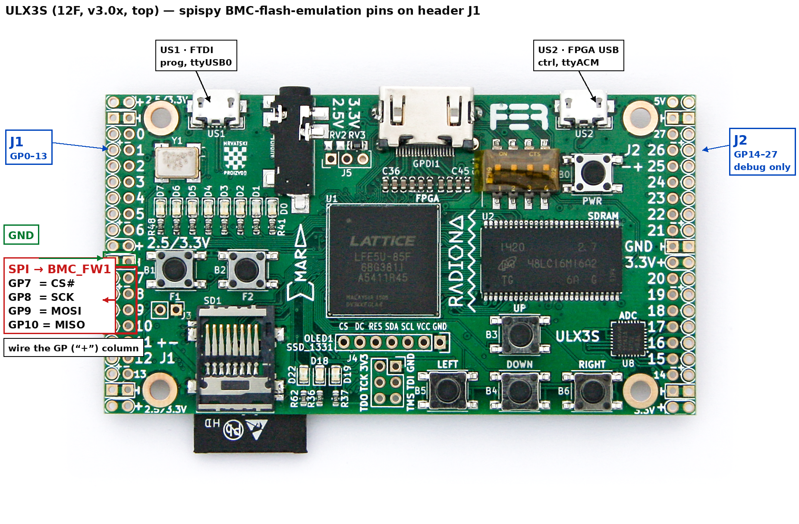
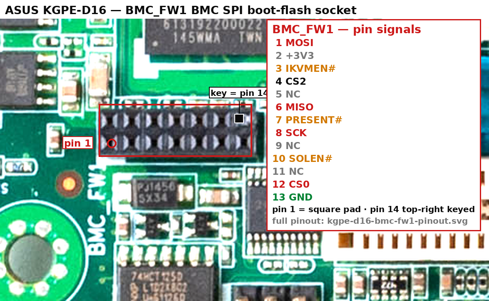

# Wiring the ULX3S (spispy) to emulate the AST2050 BMC boot flash

Connect a **ULX3S ECP5** board running [spispy](https://github.com/osresearch/spispy)
to the ASUS KGPE-D16 so the FPGA *becomes* the SPI-NOR flash the ASPEED
**AST2050** BMC boots from — in place of the socketed chip in the `BMC_FW1`
socket. This serves arbitrary BMC firmware over USB with no erase/reflash cycles
and lets you single-step the boot ROM's flash reads.

The whole connection is **four SPI wires + ground between the ULX3S and the
`BMC_FW1` socket, plus one strap tied low.** Section 1 is everything you need to
wire it; sections 2–6 are the reference and the reasoning behind each step.

> **Everything here is from primary sources.** The `BMC_FW1` pinout is from the
> board schematic ([`schematic-wiring/BMC-CONNECTORS.md`](schematic-wiring/BMC-CONNECTORS.md),
> [`AST2050-BMC-WIRING.md` §4](schematic-wiring/AST2050-BMC-WIRING.md#4-spi-firmware-flash--bmc_fw1));
> the ULX3S pins from `spispy` + the ULX3S v3.0.8 schematic. 🔶 marks the few
> items to confirm on the bench during bring-up.

---

## 1. Wire it up

**Method:** power the KGPE-D16 **off**, **pull the socketed flash carrier** out of
`BMC_FW1`, and plug the ULX3S into the socket pins below (DIP adapter, or short
flying leads keyed to socket pin 1). The AST2050's boot SPI is present directly on
the socket, so with the carrier removed the ULX3S is the only device on the bus —
no clip, no desolder, no continuity-mapping.

### The five connections

| ULX3S pin | net / FPGA ball | direction | → `BMC_FW1` pin | SPI signal (net) |
|---|---|:--:|:--:|---|
| **J1 · GP7**  | `gp[7]` / `A6`  | ← in  | **12** | **CS#**  (`AST_SPICS#0`) |
| **J1 · GP8**  | `gp[8]` / `A4`  | ← in  | **8**  | **SCK**  (`AST_SPICLK`) |
| **J1 · GP9**  | `gp[9]` / `A2`  | ← in  | **1**  | **MOSI** (`AST_SPIDO`) |
| **J1 · GP10** | `gp[10]` / `C4` | → out | **6**  | **MISO** (`AST_SPIDI`) |
| **J1 · GND**  | any J1 GND pin  | —     | **13** | **GND** |

*Direction is from the FPGA's point of view: the AST2050 drives CS#/SCK/MOSI (FPGA
inputs) and reads MISO (the FPGA's only output). All lines are 3.3 V LVCMOS —
directly compatible, no level shifting.*

### One more connection: the "present" strap

- **Jumper `BMC_FW1` pin 7 (`BMC_PRESENT#`) to pin 13 (GND)** — or to any ULX3S
  GND already on the shared ground. The BMC samples this at boot to know a
  firmware device is present; the carrier you removed was asserting it, and
  without it the BMC may not attempt to boot. 🔶

### Leave disconnected

- **Pin 2** (`+3V3_AUX`) — mainboard flash-power rail. **Do not drive or back-feed
  it** from the ULX3S.
- **Pin 4** (`AST_SPICS#2`) — second/recovery chip-select, not used for main-boot.
- **Pins 3 / 10** (`AST_IKVMEN#` / `AST_SOLEN#`) — optional feature straps (§3).
- **Pins 5 / 9 / 11** — no-connect.

### Where the pins are

**On the ULX3S:** `GP7`–`GP10` are the **`7`–`10` block on the lower-left header
`J1`**, with GND pads just above `GP7`. Wire the **`GP` ("+") column** (the board
prints a "+ −" legend by pin `11`). The right-edge header `J2` is debug-only (§4).



**On the motherboard:** find `BMC_FW1` — the **2×7 socket** with the `BMC_FW1`
silkscreen, just below the AST2050 (near `SB_PWR1` / `LOCLED1`, by the PCI slots).
Per the ASUS manual (§2.7.2), **pin 1 is the square pad at the bottom-left** and
**pin 14 is keyed (no pin) at the top-right** — use those two to orient the
socket; each pin's signal is then fixed. The photo locates the socket on the
board (both in the board's natural orientation, rear I/O to the left); the SVG is
the full pinout. Standard column-pair numbering: **odd pins on the bottom row**
(`1`,`3`,…`13` left-to-right), **even pins on the top row** (`2`,`4`,…`14`).




### Three rules that prevent damage (full list: §5)

1. **MISO (`GP10` → pin 6) is the emulator's *only* output.** Never leave the real
   flash carrier seated while the ULX3S drives it — two drivers on one net can
   damage both. *(§5 rule 1)*
2. **Common ground first.** Connect GND (pin 13) *before* any signal, and keep it
   the whole session. *(§5 rule 3)*
3. **Board OFF when (dis)connecting** — don't hot-plug SPI. *(§5 rule 6)*

---

## 2. Why `BMC_FW1` is the tap point

The AST2050 SoC is on the mainboard, but its **boot flash sits in a socketed
carrier** in `BMC_FW1`. So the SoC's SPI/ROM controller reaches its flash *through
the socket* — which is exactly why pulling the carrier exposes the boot bus for
emulation:

```
    AST2050 SPI/ROM controller (QU1)   [ soldered on the mainboard ]
              |
              |  5 SPI lines : SPICLK, SPIDO (MOSI), SPIDI (MISO), SPICS#0, SPICS#2
              |  + 3V3_AUX power, GND
              |  + 3 feature straps : IKVMEN#, BMC_PRESENT#, SOLEN#
              v
    BMC_FW1 socket (2x7 DIP)           <-- pull the carrier; the ULX3S plugs in here
              |
              v
    SPI boot flash  (S25FL128P class, 16 MB : CS0 = main firmware, CS2 = 2nd/recovery)
```

The chip is field-replaceable — convenient for the open-firmware reflashing this
repo targets — and its socket pinout is fully documented (§3).

---

## 3. `BMC_FW1` socket — full pinout (reference)

Schematic-derived, from
[`schematic-wiring/BMC-CONNECTORS.md`](schematic-wiring/BMC-CONNECTORS.md); the
socket diagram and pin-1 orientation are in §1.

| Pin | Net | Function | AST2050 ball |
|:--:|---|---|---|
| 1  | `AST_SPIDO`   | SPI **MOSI** (data out of SoC) | `Y1` (`ROMD1`) |
| 2  | `+3V3_AUX`    | Flash power (standby) | — |
| 3  | `AST_IKVMEN#` | Strap: enable iKVM | `W1` |
| 4  | `AST_SPICS#2` | SPI chip-select 2 (2nd / recovery) | `W7` (`ROMCS2#`) |
| 5  | — | no-connect | — |
| 6  | `AST_SPIDI`   | SPI **MISO** (data in to SoC) | `AA4` (`ROMD2`) |
| 7  | `BMC_PRESENT#`| Strap: BMC/carrier present (also SOL-mux select) | `A10`/`D11`/`AA9` |
| 8  | `AST_SPICLK`  | SPI **clock** | `Y2` (`ROMD0`) |
| 9  | — | no-connect | — |
| 10 | `AST_SOLEN#`  | Strap: enable Serial-over-LAN | `W2` |
| 11 | — | no-connect | — |
| 12 | `AST_SPICS#0` | SPI **chip-select 0** (main firmware) | `AB9` (`ROMCS0#`) |
| 13 | `GND` | Ground | — |

*(The 2×7 socket has a 14th position; it is unpopulated/NC — the schematic
documents 13 pins.)*

The AST2050 boots the **main firmware over CS0** (pin 12); CS2 (pin 4) is a
second/recovery device, unused for main-boot emulation.

### Feature straps (pins 3 / 7 / 10)

Pulling the carrier also removes whatever it tied on the three strap pins, which
the BMC samples at boot. All three are **active-low**:

| Pin | Net | Do this | Why |
|:--:|---|---|---|
| **7**  | `BMC_PRESENT#` | **tie low** (required) | tells the BMC a firmware device is present; also selects the SOL mux 🔶 |
| 3  | `AST_IKVMEN#`  | low = enable iKVM (optional) | leave open if not wanted 🔶 |
| 10 | `AST_SOLEN#`   | low = enable Serial-over-LAN (optional) | leave open if not wanted 🔶 |

Start with only `BMC_PRESENT#` low; add the others if you need those features.
Confirm against a known-good boot — the exact pull the OEM carrier applied is what
you're matching. 🔶

### Power (pin 2, `+3V3_AUX`)

Mainboard-supplied standby rail for the (now-absent) flash. The emulator does
**not** need it and must **not** back-drive it — leave it unconnected. (Optionally
use it as a bank Vref only if you remove ULX3S `RV3`; for this 3.3 V target, keep
`RV3` and run the `gp[]` bank at its own 3.3 V.)

---

## 4. ULX3S headers — full map (reference)

spispy drives the emulated flash on ULX3S header **J1**, pins `gp[7]`–`gp[10]`
(from `verilog/spispy.v` + `verilog/ulx3s_v20.lpf`). The §1 table already gives
the four you wire; this section is the complete header layout and the optional
debug taps.

> **Wire by the `GP`/`GN` silkscreen label, not a bare pin number.** The 1–40 pin
> numbers below are the schematic's **female 90° angled** numbering; the schematic
> notes *"for a MALE VERTICAL header, SWAP EVEN and ODD pin numbers."* So `GP7` is
> printed **pin 24** (female-angled) or **pin 23** (male-vertical, which is what
> `ulx3s_v20.lpf`'s `J1_23` uses). The `GP7`…`GP10` labels are unambiguous;
> confirm against the board silkscreen + a meter.

Both `J1` and `J2` are `CONN_02X20` (2×20, 40-pin) 2.54 mm headers. Odd-pin row =
`GN`, even-pin row = `GP` (female-angled). `★` = wired spispy signal; `◦` =
optional debug tap; FPGA balls in parentheses.

**Header J1 — `GP`/`GN` 0–13 (all four wired signals live here):**

| Odd pin | `GN` row | | Even pin | `GP` row |
|--:|---|---|--:|---|
| 1 | +3V3 | | 2 | +3V3 |
| 3 | GND | | 4 | GND |
| 5 | GN0 (C11) | | 6 | GP0 (B11) |
| 7 | GN1 (A11) | | 8 | GP1 (A10) |
| 9 | GN2 (B10) | | 10 | GP2 (A9) |
| 11 | GN3 (C10) | | 12 | GP3 (B9) |
| 13 | GN4 (A8) | | 14 | GP4 (A7) |
| 15 | GN5 (B8) | | 16 | GP5 (C8) |
| 17 | GN6 (C7) | | 18 | GP6 (C6) |
| 19 | +3V3 | | 20 | +3V3 |
| 21 | **GND** | | 22 | **GND** |
| 23 | GN7 (B6) | | 24 | **★ GP7 = CS# (A6)** |
| 25 | GN8 (A5) | | 26 | **★ GP8 = SCK (A4)** |
| 27 | GN9 (B1) | | 28 | **★ GP9 = MOSI (A2)** |
| 29 | GN10 (B4) | | 30 | **★ GP10 = MISO (C4)** |
| 31 | GN11 (E3) | | 32 | GP11 (F4) |
| 33 | GN12 (F3) | | 34 | GP12 (G3) |
| 35 | GN13 (G5) | | 36 | GP13 (H4) |
| 37 | **GND** | | 38 | **GND** |
| 39 | +3V3 | | 40 | +3V3 |

Use a J1 **GND** at pins **21/22** (right by the SPI block) or **37/38** for the
ground return.

**Header J2 — `GP`/`GN` 14–27 (optional debug taps only; carries 5 V):**

*Pins 1–4 and 19–22 are +3V3/GND exactly like J1 (omitted below); the table starts
at pin 5. These taps drive a scope/logic-analyzer and are not required to wire.*

| Odd pin | `GN` row | | Even pin | `GP` row |
|--:|---|---|--:|---|
| 5  | GN14 (U17) | | 6  | GP14 (U18) |
| 7  | **◦ GN15 (P16) = read≠0x03** | | 8  | GP15 (N17) |
| 9  | GN16 (M17) | | 10 | GP16 (N16) *(TOCTOU, unused)* |
| 11 | GN17 (L17) | | 12 | GP17 (L16) |
| 13 | GN18 (H17) | | 14 | GP18 (H18) |
| 15 | **◦ GN19 (G18) = SCK echo** | | 16 | GP19 (F17) |
| 17 | **◦ GN20 (E17) = CS# echo** | | 18 | GP20 (D18) |
| 23–36 | GN21–27 | | 24–36 | GP21–27 |
| 39 | **+5V** (IN5V) | | 40 | **+5V** (OUT5V) |

> **⚠️ The `GN` (odd) row is FPGA signal, not ground.** Only J2 pins **39/40 are
> 5 V** — the GPIO is **not** 5 V tolerant, so keep those clear of signal jumpers
> (J1 has no 5 V). Always take GND from a silkscreen-marked GND pin, meter-checked.

**spispy behaviour:** it defaults to pure emulation (`ENABLE_EMULATION=1`,
`ENABLE_TOCTOU=0`) — the FPGA is the sole bus device, matching our carrier-removed
setup, so the real-chip-reset / TOCTOU pins (`gp[11]`/`gp[16]`) are unused, and
`wifi_gpio0` is held high so the board won't reboot.

---

## 5. Electrical rules — read before powering on

1. **Single MISO driver.** The emulator (pin 6 / `gp[10]`) must be the only device
   driving MISO. The carrier must be out (or its flash disabled) — two drivers on
   one net risks damage.
2. **3.3 V, compatible.** AST2050 SPI I/O is 3.3 V; the ULX3S `gp[]` bank is
   `LVCMOS33`. No level shifting.
3. **Common ground first.** Bond ULX3S GND ↔ `BMC_FW1` pin 13 before any signal;
   keep it for the whole session. A floating ground corrupts every SPI edge.
4. **Never back-drive `+3V3_AUX`** (pin 2).
5. **Keep leads short.** ≤10 cm flying leads, a ground return near the clock, and
   CS#/SCK routed away from MOSI/MISO. If reads are flaky, lower the AST2050 SMC
   clock (SCU/SMC divisor) before suspecting the gateware.
6. **Board OFF when (dis)connecting.** Power the KGPE-D16 down (Tasmota
   `au-plug-10`, [`HARDWARE-ACCESS.md`](HARDWARE-ACCESS.md)); don't hot-plug SPI.

---

## 6. Bring-up / verification

1. Board **OFF**. Remove the flash carrier from `BMC_FW1`.
2. Wire the five §1 connections (`GP7`→12, `GP8`→8, `GP9`→1, `GP10`→6, GND→13) and
   tie `BMC_PRESENT#` (pin 7) low. Re-check that `GP10`→pin 6 is the only output.
3. Load the spispy bitstream on the ULX3S (`openFPGALoader -b ulx3s spispy.bit`;
   the build/flash setup is covered separately) and preload a known-good BMC image
   into the emulator's RAM over USB.
4. Power the board **ON** and confirm the SMC is clocking the emulated flash: scope
   `CS#` at `BMC_FW1` pin 12 and `SCK` at pin 8 directly — or, if you wired the
   optional J2 taps (§4), watch their `CS#`/`SCK` echoes.
5. Confirm the BMC boots the served image: BMC console on
   `/dev/serial-bmc-console` (1200 8N1) and/or P2A/JTAG
   ([`HARDWARE-ACCESS.md`](HARDWARE-ACCESS.md)). Booting our image with **no
   physical reflash** is the success criterion.
6. If the SMC never reads (step 4), re-check `BMC_PRESENT#` and the other straps
   (§3) — the BMC may be gating boot on them. 🔶

---

## Sources

- **`BMC_FW1` pinout** (nets, functions, balls) —
  [`schematic-wiring/BMC-CONNECTORS.md`](schematic-wiring/BMC-CONNECTORS.md) +
  [`AST2050-BMC-WIRING.md` §4](schematic-wiring/AST2050-BMC-WIRING.md#4-spi-firmware-flash--bmc_fw1),
  schematic-derived (PR #29).
- **ULX3S spispy pins** — `osresearch/spispy` `verilog/spispy.v`
  (`spi_cs_pin=gp[7]` … `spi_miso_pin=gp[10]`) + `verilog/ulx3s_v20.lpf`
  (`gp[7]→A6` … `gp[10]→C4`, all `IO_TYPE=LVCMOS33`).
- **ULX3S J1/J2 layout, power/GND/5 V pins, pin-numbering caveat** — ULX3S
  **v3.0.8 schematic** `emard/ulx3s` `doc/schematics_v308.pdf` (`gpio.sch`); board
  photo `pic/ULX3S_v303_top.png`; <https://www.crowdsupply.com/radiona/ulx3s>.
- **Flash part family** (S25FL128P / M25P128 / MX25L12835F, 16 MB class) —
  [`datasheets/README.md`](datasheets/README.md).
- **Rig / power / consoles** — [`HARDWARE-ACCESS.md`](HARDWARE-ACCESS.md).
