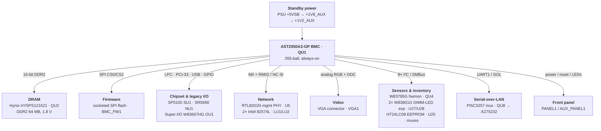
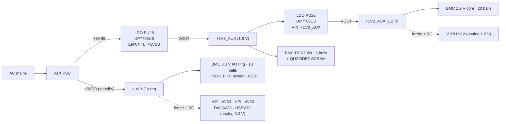
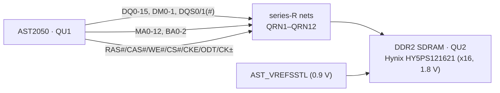
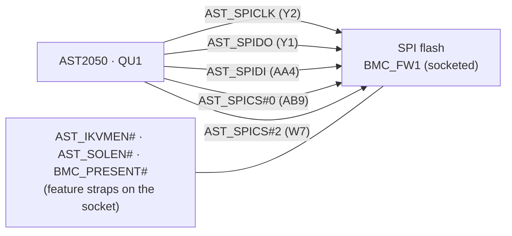
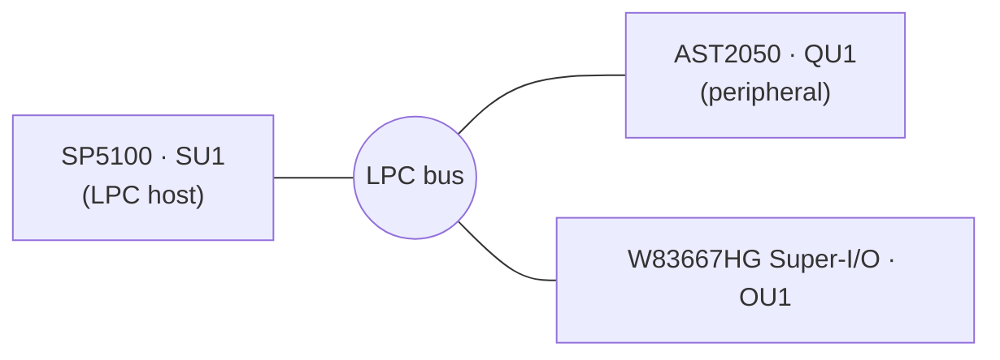
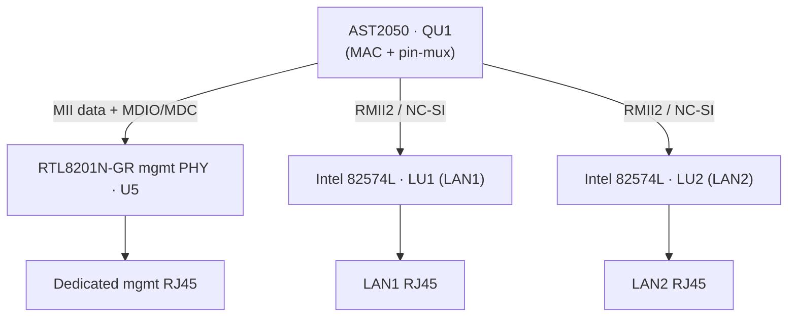
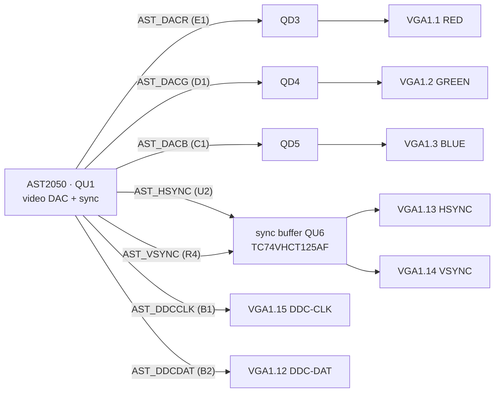
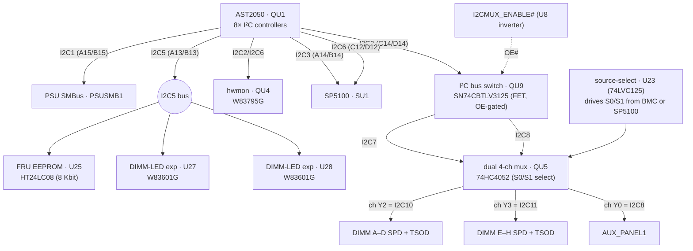
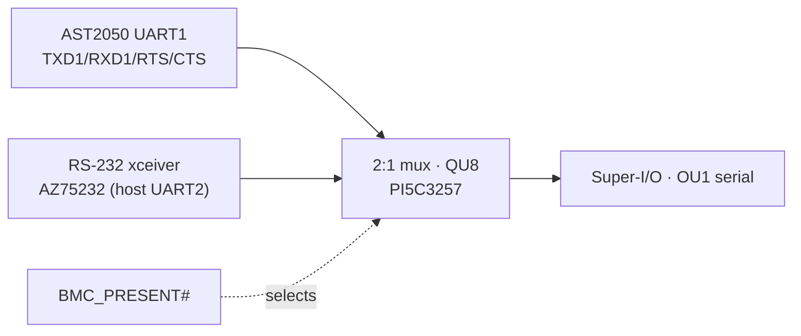

# ASUS KGPE-D16 — ASPEED AST2050 BMC wiring

Complete, human-readable documentation of **every pin** of the ASPEED
**AST2050A3-GP** Baseboard Management Controller (board reference designator
**`QU1`**) on the ASUS KGPE-D16 (rev 1.04B), organised by logical function, with
every connection traced to its far end — *through* the series resistors,
resistor networks, I²C muxes, GPIO expanders and buffers that sit between the
BMC and the rest of the board.

Unlike a guessed BOM, every support-chip identity here is **read directly from
the schematic's part-description field** (the KGPE-D16 `.FZ` carries full
descriptions), so part numbers are quoted, not inferred.

## Source of this data

Extracted from the board's OpenBoardView `.FZ` schematic export
(`KGPE-D16 r1.04B(59SB0010-MB0D06S).FZ`) — an RC6-encrypted, zlib-compressed
netlist. The tools in [`tools/`](tools/) decrypt it, parse it, and emit the
per-pin tables in [`pinmaps/`](pinmaps/); see [README.md](README.md) to
regenerate. The AST2050 ball *names* (e.g. `MIIRXD2/RMII2RXD0/GPIOE2`) come
verbatim from the schematic's pin-name field.

The complete machine-generated per-pin table for all 355 balls — including, for
every functional section, a **"Connected components"** list of the chips those
pins reach — is in
**[pinmaps/QU1_pins.md](pinmaps/QU1_pins.md)**. This document is the narrative +
diagrams that explain it.

## At a glance

| Property | Value |
|---|---|
| Part | ASPEED **AST2050A3-GP** (server BMC / iKVM SoC, ARM926EJ-S), TFBGA-355 |
| Ref des | `QU1` |
| Balls | 355 populated (col A–AB × row 1–22) |
| Core supply | `+1V2_AUX` (1.2 V) — 20 balls |
| DDR I/O supply | `+1V8_AUX` (1.8 V) — 6 balls |
| I/O supply | `+3V3_AUX` (3.3 V) — 18 balls |
| Ground | 66 balls |
| External DRAM | `QU2` — Hynix **HY5PS121621CFP-25**, DDR2 32M×16, 1.8 V (64 MB) |
| Firmware | `BMC_FW1` — **socketed** SPI flash |
| Always-on? | **Yes** — every rail is `_AUX` (standby), fed from PSU `+5VSB` |

### Ball count by function

| Function block | Balls |
|---|---|
| [DDR2 memory (→ QU2)](#3-ddr2-memory-interface--qu2) | 48 |
| [SPI / ROM flash (→ BMC_FW1)](#4-spi-firmware-flash--bmc_fw1) | 27 |
| [LPC host bus (→ SP5100 + Super-I/O)](#5-lpc-host-bus--sp5100-su1--super-io-ou1) | 10 |
| [PCI 33 MHz (VGA / iKVM, → SP5100 + slots)](#6-pci-33-mhz-bus-vga--ikvm--sp5100-su1--pci-slots) | 45 |
| [USB (→ SP5100)](#9-usb-device-port--sp5100-su1) | 6 |
| [Ethernet RMII / NC-SI (→ RTL8201N + 2× 82574L)](#7-ethernet--dual-channel-dedicated-phy--nc-si-sideband) | 18 |
| [VGA / video (→ VGA connector)](#8-vga--video-output--vga1) | 14 |
| [I²C / SMBus (8 buses)](#10-i²c--smbus-topology-traced-through-every-mux--expander) | 16 |
| [Serial / SOL (UART)](#12-serial--serial-over-lan-sol) | 11 |
| [JTAG / test](#13-jtag--test-leds-clock-straps) | 11 |
| [Power / reset / platform control](#11-power--reset--platform-control-gpio) | 17 |
| [LEDs / indicators](#13-jtag--test-leds-clock-straps) | 6 |
| [Clock](#13-jtag--test-leds-clock-straps) | 1 |
| [Strap / config](#13-jtag--test-leds-clock-straps) | 2 |
| Other / GPIO / analog | 9 |
| [Power / decoupling](#2-power-supply) | 48 |
| [Ground](#2-power-supply) | 66 |
| **Total** | **355** |

---

## 1. High-level block diagram

The AST2050's connections, grouped by destination so the whole picture fits at a
glance. Each grey cluster is expanded into its own low-level diagram later in
this document. Everything runs from standby power, so the BMC is alive whenever
the PSU has AC.

**Reading it — the AST2050 has three "personalities" wired here:**

- **Baseboard controller.** Talks to the chipset over LPC, PCI-33 and GPIO for
  power sequencing, reset control and sensor access — the `CHIP` and `SENS`
  clusters.
- **Remote-KVM engine.** Has its own DDR2 frame buffer (`QU2`), a VGA output
  (`VID`), a USB **device** port for virtual keyboard/mouse/media (inside
  `CHIP`), and a PCI attachment used to capture the host's video.
- **Network stack.** A dedicated Realtek RTL8201N management PHY over MII **and**
  an NC-SI sideband that shares the two Intel 82574L host NICs (`NET`).

---

## 2. Power supply

Every BMC rail is standby (`_AUX`), cascaded from the PSU's `+5VSB` output, so
the controller runs independent of host power state. The two step-down LDOs are
UPI **UP7706U8** parts.

| Rail | Volt | Balls | Purpose | Source |
|---|---|---|---|---|
| `+1V2_AUX` | 1.2 V | 20 | AST2050 digital core | PU22 (from +1V8_AUX) |
| `+1V8_AUX` | 1.8 V | 6 | DDR2 I/O ring (shared with QU2) | PU28 (from +5VSB) |
| `+3V3_AUX` | 3.3 V | 18 | General I/O ring | aux 3.3 V reg (from +5VSB) |
| `AST_V1PLLV12` | 1.2 V | J2 J4 | Core PLL analog | filtered +1V2_AUX |
| `AST_MPLLAV33` | 3.3 V | K2 L4 | Memory-PLL analog | filtered +3V3_AUX |
| `AST_HPLLAV33` | 3.3 V | M2 M4 | Host/video-PLL analog | filtered +3V3_AUX |
| `AST_DACAV33` | 3.3 V | D3 E3 F1 G1 H3 | Video-DAC analog | filtered +3V3_AUX |
| `AST_USBV33` | 3.3 V | B18 B20 | USB-PHY analog | filtered +3V3_AUX |
| `AST_VREFSSTL` | 0.9 V | T18 AB12 | DDR2 SSTL reference (½·1.8 V) | divider |
| `GND` | 0 V | 66 | Ground | — |

---

## 3. DDR2 memory interface → `QU2`

The AST2050 has its own private **16-bit DDR2 SDRAM** — a Hynix
**HY5PS121621CFP-25** (32M×16, 1.8 V, 64 MB) at `QU2` — used as BMC system RAM
and remote-KVM frame buffer. Every data/strobe/address/control line runs through
an **isolated series-resistor network** (`QRN1`–`QRN12`, adjacent-pin pairs;
`AST_MEMxx` → `R_AST_MEMxx`) for source-series termination.

Ball-level detail (48 balls) — including the per-net `QU2` endpoint — is in
[pinmaps/QU1 → DDR2 memory](pinmaps/QU1_pins.md#ddr2-memory-48). Highlights:
`CS#`=W16, `RAS#`=AA16, `CAS#`=AB16, `WE#`=W17, `CK/CK#`=AA19/AB19,
`CKE`=AB18, `ODT`=AB21; DQ0–15 across W/Y/AA/AB rows 10–15.

> **Two different "DDR thermal" signals — don't conflate.** Balls **T2/T3**
> (`AST_P1/P0_DDR_THERM#`) are BMC GPIOs monitoring the *host's* DDR3 DIMM/CPU
> thermal alarms — see §11. They have nothing to do with the BMC's own DDR2
> above.

---

## 4. SPI firmware flash → `BMC_FW1`

The BMC boots from a **socketed** SPI flash (`BMC_FW1`), driven by the AST2050
SPI/ROM controller — the chip is field-replaceable, which is convenient for the
open-firmware reflashing this repo targets.

| AST2050 ball | Pin name | Net | Role |
|---|---|---|---|
| Y2 | `ROMD0` | `AST_SPICLK` | SPI clock |
| Y1 | `ROMD1` | `AST_SPIDO` | SPI MOSI |
| AA4 | `ROMD2` | `AST_SPIDI` | SPI MISO |
| AB9 | `ROMCS0#` | `AST_SPICS#0` | Chip-select 0 (main firmware) |
| W7 | `ROMCS2#` | `AST_SPICS#2` | Chip-select 2 (2nd device / recovery) |

The legacy parallel-ROM address bus `AST_ROMA0`–`AST_ROMA23` (balls W5–AB8) is
only series-terminated here (SPI mode is used); those pins act as spare GPIO.
Full detail: [pinmaps/QU1 → SPI / ROM flash](pinmaps/QU1_pins.md#spi--rom-flash-27).

---

## 5. LPC host bus → SP5100 (SU1) + Super-I/O (OU1)

The AST2050 is an **LPC peripheral** on the SP5100 southbridge's LPC bus, sharing
it with the Nuvoton W83667HG Super-I/O (`OU1`). This carries the host's KCS/IPMI,
mailbox and virtual-UART register access. (The Super-I/O is documented in full in
[W83667HG-SUPERIO-WIRING.md](W83667HG-SUPERIO-WIRING.md).)

| AST2050 ball | Pin name | Net | To SP5100 (SU1) | To Super-I/O (OU1) |
|---|---|---|---|---|
| A16 | `LCLK` | `LPC_CLK0` | G22 | (clocked from SB) |
| B16 | `LFRAME#` | `LPC_FRAME#` | H25 | 25 |
| B17 | `LAD0` | `LPC_LAD0` | H24 | 23 |
| A17 | `LAD1` | `LPC_LAD1` | H23 | 22 |
| D16 | `LAD2` | `LPC_LAD2` | J25 | 21 |
| C16 | `LAD3` | `LPC_LAD3` | J24 | 20 |
| C15 | `LPCSIRQ` | `LPC_SERIRQ` | V15 | 19 |

Full detail: [pinmaps/QU1 → LPC host bus](pinmaps/QU1_pins.md#lpc-host-bus-10).

---

## 6. PCI 33 MHz bus (VGA / iKVM) → SP5100 (SU1) + PCI slots

The AST2050's integrated VGA + video-capture appears as a **PCI device on the
SP5100's 33 MHz PCI bus**, shared with the physical PCI slots. This is the
datapath the iKVM engine uses to capture host video and to expose the on-board
VGA as a PCI graphics device. The BMC drives the full multiplexed interface
(`AD0–31`, `C/BE0–3#`, `FRAME#`, `IRDY#`, `TRDY#`, `DEVSEL#`, `STOP#`, `PAR`,
`IDSEL`), `PCICLK` (`SB_PCI_CLK1`, P22) and `PCIRST#` (`SB_PCI_RST#`, B10).

45 balls — see [pinmaps/QU1 → PCI (33MHz)](pinmaps/QU1_pins.md#pci-33mhz-45).

---

## 7. Ethernet — dual channel: dedicated PHY + NC-SI sideband

The AST2050's MAC is wired **two ways at once** via its pin-mux:

- **Channel 1 (MII → dedicated management PHY `U5`).** `AST_MIIMDIO/MDC` +
  `AST_RMII1*` run to `U5` = Realtek **RTL8201N-GR** (QFN64) — the physically
  separate BMC management LAN port.
- **Channel 2 (RMII2 / NC-SI → host NICs).** `AST_RMII2*` bus to both Intel
  **WG82574L** gigabit NICs (`LU1`=LAN1, `LU2`=LAN2), so the BMC can share the
  host's network ports.

Key balls:

| Signal | BMC ball | Channel | Endpoint |
|---|---|---|---|
| MDIO | A2 | MII management | `U5` |
| MDC | A3 | MII management | `U5` |
| MII TXD0 / TXD1 | A4 / B4 | MII (ch 1) | `U5` |
| MII TXEN | C5 | MII (ch 1) | `U5` |
| MII RXD0 / RXD1 | C6 / D6 | MII (ch 1) | `U5` |
| MII RXER | C7 | MII (ch 1) | `U5` |
| MII CRSDV | D7 | MII (ch 1) | `U5` |
| RMII2 RXD0 / RXD1 | A5 / B5 | NC-SI (ch 2) | `LU1` + `LU2` |
| RMII2 CRSDV | B6 | NC-SI (ch 2) | `LU1` + `LU2` |
| RMII2 TXD0 / TXD1 | C4 / D4 | NC-SI (ch 2) | `LU1` + `LU2` |
| RMII2 TXEN | D5 | NC-SI (ch 2) | `LU1` + `LU2` |

Full detail:
[pinmaps/QU1 → Ethernet RMII / NC-SI](pinmaps/QU1_pins.md#ethernet-rmii--nc-si-18).

---

## 8. VGA / video output → `VGA1`

The AST2050's VGA controller drives the rear **VGA connector** (`VGA1`): analog
RGB from the on-chip DAC (buffered by transistors `QD3/4/5`), sync buffered by
`QU6` (Toshiba **TC74VHCT125AF** quad bus buffer), and DDC (monitor EDID) I²C to
the connector.

Full detail: [pinmaps/QU1 → VGA / video](pinmaps/QU1_pins.md#vga--video-14).

---

## 9. USB device port → SP5100 (SU1)

A single USB port used as a **device** (virtual keyboard/mouse/CD for remote
KVM), connected to the SP5100's USB host: `AST_USB+`=B22, `AST_USB-`=A21 → SU1
E12/E14; `AST_USBRPU`=B21 pull-up strap; USB analog 3.3 V on B18/B20.

---

## 10. I²C / SMBus topology (traced through every mux & expander)

This is the BMC's sensor and inventory nervous system. The AST2050 provides
**eight I²C/SMBus controllers** (`SDA1/SCL1` … `SDA7/SCL7` on dedicated balls,
plus a muxed 8th). Between the BMC and the end devices sit an I²C bus switch, a
dual 4-channel analog mux, and a source-select buffer. This section documents
each device — part number, address, protocol, and the **exact steps** to reach
it.

### 10.1 The switching fabric

### 10.2 Device-by-device breakdown

Addresses below are the standard 7-bit device addresses for each part (from the
device datasheets); where an address is set by strap pins, that is noted. The
**bus segment** column says which physical wire the device sits on, and
**"access"** gives the mux state the BMC must establish first.

| Device | Ref | Part | Bus segment | Addr (7-bit) | Protocol | Access steps |
|---|---|---|---|---|---|---|
| PSU management | `PSUSMB1` | PSU SMBus header | **I2C1** (direct) | PMBus device addr (PSU-specific) | SMBus / PMBus | Direct on I2C1 balls A15/B15; alert on `SCL7/SALT1` (B12). No mux. |
| Hardware monitor | `QU4` | Winbond **W83795G** | **I2C2** (`83795_I2C13`) | `0x2F` default (strap `ADDR0/ADDR1` = pins 41/43) | SMBus, bank-switched register file | Direct on I2C2 (C14/D14). Read `VSEN1–11`, temps `TR1–6`/PECI-TSI, `FANIN1–12`; write `FANCTL1–8` PWM. |
| CPU thermal (SB-TSI/PECI) | via `QU4` | AMD SB-TSI on `TSI_SCL/SDA` | **I2C4** (C13/D13) → QU4 pins 29/30 | AMD SB-TSI 0x4C/0x4D | SMBus | Direct on I2C4 through level-shift FETs `Q56–Q59`. |
| Board FRU EEPROM | `U25` | Holtek **HT24LC08** (8 Kbit) | **I2C5** (A13/B13) | `0x50`–`0x53` (2-bit block in cmd) | I²C EEPROM (16-byte page write) | Direct on I2C5. |
| DIMM error-LED expander (A–F set) | `U27` | Winbond **W83601G** | **I2C5** | strap `A0/A1/A2` (pins 3/4/5) | I²C GPIO (SCLK/SDAT) | Direct on I2C5; write GP10–GP26 to light `DIMM{A1,A2,B1,B2,C1,C2,D1,D2,E1,E2,F1,F2}ERRLED`. |
| DIMM error-LED expander (G/H set) | `U28` | Winbond **W83601G** | **I2C5** | strap `A0/A1/A2` (different from U27) | I²C GPIO | Direct on I2C5; drives `DIMM{G1,G2,H1,H2}ERRLED`. |
| DIMM A–D SPD | `DIMM_A1…D2.pin238/118` | JEDEC SPD EEPROM | **I2C10** (QU5 ch Y2) | `0x50`–`0x57` (per slot) | I²C SPD (DDR3) | 1) assert `I2CMUX_ENABLE#` low (QU9 bridges I2C2↔I2C7); 2) set QU5 select `S1:S0 = 1:0` via `AST_I2CS1:AST_I2CS0` (W3:W4); 3) address SPD 0x50+slot on I2C2. |
| DIMM A–D thermal (TSOD) | same slots | JEDEC TS-on-DIMM | **I2C10** | `0x18`–`0x1F` | I²C temp sensor | Same mux state as SPD A–D; address 0x18+slot. |
| DIMM E–H SPD | `DIMM_E1…H2.238/118` | JEDEC SPD EEPROM | **I2C11** (QU5 ch Y3) | `0x50`–`0x57` | I²C SPD (DDR3) | As above but QU5 select `S1:S0 = 1:1`. |
| DIMM E–H thermal (TSOD) | same slots | JEDEC TS-on-DIMM | **I2C11** | `0x18`–`0x1F` | I²C temp sensor | QU5 select `S1:S0 = 1:1`; address 0x18+slot. |
| Aux front panel | `AUX_PANEL1` | header | **I2C8** (QU5 ch Y0) | — | I²C | QU9 enabled + QU5 select `S1:S0 = 0:0`. |

### 10.3 How the muxes are controlled (the "steps" in detail)

- **`QU9` — TI SN74CBTLV3125 quad FET bus switch.**
  - Four independent FET switches, each with its own active-low `OE#`.
  - Here **all four `OE#` are tied to `I2CMUX_ENABLE#`** (from inverter `U8`, pin 12).
  - When `I2CMUX_ENABLE#` is low, QU9 connects the BMC's `I2C2` to `I2C7`
    (switches 1&2, `1A↔1B`/`2A↔2B`) and `I2C8↔I2C8_SW` (switches 3&4).
  - Being a FET switch it is **transparent and non-addressable** — no I²C
    transaction, it just makes/breaks the wire.
- **`QU5` — 74HC4052 dual 4-channel analog mux/demux.**
  - Its common pair (`2Z`=`I2C7SDA` pin 3, `1Z`=`I2C7SCL` pin 13) is routed to
    one of four channel pairs by two select inputs `S1` (pin 9) and `S0` (pin 10).
  - Channel map on this board: **`Y0`→I2C8, `Y1`→(unused), `Y2`→I2C10 (DIMM
    A–D), `Y3`→I2C11 (DIMM E–H)**.
  - 74HC4052 truth table: `S1:S0 = 00→Y0, 01→Y1, 10→Y2, 11→Y3`.
  - So DIMM A–D = `10`, DIMM E–H = `11`, aux panel = `00`.
- **`U23` — 74LVC125 quad buffer (source-select).**
  - The QU5 select lines `S0`/`S1` (`I2CS0`/`I2CS1`) are driven through U23 from
    **either** the BMC (`AST_I2CS0`=W4, `AST_I2CS1`=W3) **or** the SP5100
    (`SB_I2CS0/1`), depending on which buffer's `OE#` is enabled (`N51800495` for
    the BMC pair, `N51800497` for the SP5100 pair).
  - This arbitrates bus ownership: whichever host is enabled chooses the DIMM
    channel.

**Worked example — the BMC reads the SPD of DIMM slot C1 (DDR3):**

1. Take ownership: enable the BMC's `U23` buffers (`N51800495`) so `AST_I2CS0/1`
   drive `I2CS0/1`.
2. Assert `I2CMUX_ENABLE#` low → `QU9` bridges the BMC's `I2C2` onto `I2C7` (the
   QU5 common).
3. Drive `AST_I2CS1:AST_I2CS0 = 1:0` → `QU5` selects channel `Y2` = `I2C10`
   (DIMM A–D bank).
4. On `I2C2`, address the SPD EEPROM at `0x50 + <C1 slot index>` and read.
   (For the C1 temperature sensor, address `0x18 + <slot index>` on the same
   channel.)

> **Why the mux at all?** SPD EEPROMs live at fixed addresses `0x50–0x57` per
> channel, so 16 DIMMs would collide on one bus. The `QU5` demux splits them into
> two 8-slot banks (A–D, E–H), each with its own `0x50–0x57` space; the board
> EEPROM `U25` (also `0x50`-range) is isolated on the separate `I2C5` segment for
> the same reason.

### 10.4 BMC I²C bus assignments (quick reference)

| Bus | SDA / SCL balls | Reaches |
|---|---|---|
| I2C1 | A15 / B15 | PSU SMBus (`PSUSMB1`); alert on B12 |
| I2C2 | C14 / D14 | hwmon `QU4` (W83795G); switch `QU9` → DIMM buses |
| I2C3 | A14 / B14 | SP5100 `SU1` |
| I2C4 | C13 / D13 | `QU4` TSI / CPU SB-TSI (via FETs) |
| I2C5 | A13 / B13 | EEPROM `U25` + DIMM-LED expanders `U27`, `U28` |
| I2C6 | C12 / D12 | SP5100 `SU1`, hwmon `QU4` |
| I2C7 | A12 / B12 | SMBus ALERT (`SALT1/2`); mux common via `QU9`/`QU5` |
| I2C8 | (muxed) | via `QU9` / `QU5` → aux panel |

Full ball detail (with the auto-generated Connected-components list):
[pinmaps/QU1 → I²C / SMBus](pinmaps/QU1_pins.md#i2c--smbus-16).

---

## 11. Power / reset / platform control (GPIO)

The GPIOs that make the AST2050 a *baseboard* controller — power the host on/off,
hold/release resets, read fatal-thermal events, disable CPUs. (Signal names use
`P0`/`P1` for the two sockets.)

| AST2050 ball | Pin name | Net | Reaches | Meaning |
|---|---|---|---|---|
| A9 | `GPIOC1/PECIO` | `AST_ATXPSON#` | glue `U8` → PSU PS_ON# | **Soft power on/off** |
| D9 | `GPIOB6/VBDO/WDTRST` | `SYS_PWRGD` | `U8`, `SU1`, FETs | System power-good |
| A11 | `GPIOB1/FLBUSY#` | `AST_PWRBTN#` | `PANEL1`, `QU4.38` | Front-panel power button |
| D10 | `GPIOB2/FLWP#` | `AST_SYSRESET#` | `PANEL1`, `SU1` | System reset |
| B10 | `GPIOB4/VBCS/LRST#` | `SB_PCI_RST#` | `SU1`, `VGA_SW1` | PCI/LPC reset from SB |
| C9 | `GPIOB7/VBDI/EXTRST#` | `AST_BIOSREVRY#` | `RECOVERY1`, `SU1` | BIOS recovery request |
| B9 | `GPIOC0/PECII` | `AST_CLRTC#` | `SQ8` | Clear CMOS/RTC |
| D8 | `GPIOC2/PWM1` | `AST_CPU1DISABLE#` | `CPU1.AJ19` | Disable CPU1 |
| C8 | `GPIOC3/PWM2` | `AST_CPU2DISABLE#` | `CPU2.AJ19` | Disable CPU2 |
| V4 | `VP8/GPIOF0/TACH8` | `TTL_P1_THERMTRIP#` | CPUs, `SU1` | CPU1 THERMTRIP# (fatal) |
| V3 | `VP9/GPIOF1/TACH9` | `TTL_P2_THERMTRIP#` | CPUs, `SU1` | CPU2 THERMTRIP# |
| V2 | `VP10/GPIOF2/TACH10` | `TTL_P1_PROCHOT#` | `CPU1.AJ19` | CPU1 PROCHOT# monitor |
| V1 | `VP11/GPIOF3/TACH11` | `TTL_P2_PROCHOT#` | `CPU2.AJ19` | CPU2 PROCHOT# monitor |
| T3 | `VP4/GPIOE4/TACH4` | `AST_P0_DDR_THERM#` | CPU1 + DIMM A–D | Socket-0 DIMM/CPU thermal |
| T2 | `VP5/GPIOE5/TACH5` | `AST_P1_DDR_THERM#` | CPU2 + DIMM E–H | Socket-1 DIMM/CPU thermal |
| T1 | `VPACLK/GPIOH7` | `AST_NMI#` | `PANEL1`, `ND1` | NMI generation/sense |

Full detail:
[pinmaps/QU1 → Power / reset / platform control](pinmaps/QU1_pins.md#power--reset--platform-control-17).

---

## 12. Serial / Serial-over-LAN (SOL)

The AST2050 UART1 is the SOL console, routed through a **2:1 mux (`QU8`, Pericom
PI5C3257)** that selects between the BMC's UART and the host's UART2 (from
RS-232 transceiver **AZ75232**) into the Super-I/O — so the same serial console
can be owned by either the host or the BMC. Select is `BMC_PRESENT#`.

Key balls:

| Signal | BMC ball | Endpoint |
|---|---|---|
| `TXD1` | Y22 | `QU8` (mux) |
| `RXD1` | AA22 | `QU8` |
| `NRTS1` | V21 | `QU8` |
| `NCTS1` | W22 | `QU8` |

Full detail: [pinmaps/QU1 → Serial / SOL](pinmaps/QU1_pins.md#serial--sol-uart-11).

---

## 13. JTAG / test, LEDs, clock, straps

- **JTAG (ARM debug):** `TCK`=U22, `TMS`=T19, `TDI`=T21, `TDO`=R19, `NTRST`=T20,
  `RTCK`=T22, brought to the `AST_JTAG1` header. `AST_SRST#`=R20 is the global
  BMC/PHY reset (fans to Super-I/O, SP5100, `U5`, glue `U7`).
- **LEDs:** `AST_BMCRDYLED`=R2 (→ `BMC_LED1`), `AST_CPU1/2ERRLED`=T4/R1,
  `AST_MLED`=R3 (heartbeat), `AST_IDLEDSTATUS`=Y4 / `AST_IDBNT#`=Y3 (chassis-ID).
- **Clock:** `AST_24M_CLKIN`=R22 (→ `QOSC1`) — 24 MHz SoC reference.
- **Straps:** `IPMI_SEL`=A8, `AST_IKVMEN#`=W1, `AST_SOLEN#`=W2 (feature-enable
  jumpers on the flash socket).

Full detail:
[JTAG](pinmaps/QU1_pins.md#jtag--test-11) ·
[LEDs](pinmaps/QU1_pins.md#leds--indicators-6) ·
[Clocks](pinmaps/QU1_pins.md#clocks-1) ·
[Straps](pinmaps/QU1_pins.md#strap--config-2).

---

## 14. Neighbour-chip reference

All identities are read from the schematic's part-description field (no
inference):

| Ref | Part (from schematic) | Role |
|---|---|---|
| `QU2` | Hynix HY5PS121621CFP-25 DDR2 32M×16 | BMC system RAM / KVM frame buffer |
| `BMC_FW1` | socketed SPI flash | BMC firmware (field-replaceable) |
| `U5` | Realtek RTL8201N-GR (QFN64) | Dedicated management LAN PHY (MII) |
| `LU1`/`LU2` | Intel WG82574L (QFN64) | Host GbE NICs (LAN1/LAN2) + NC-SI |
| `QU4` | Winbond W83795G (LQFP-64) | Hardware monitor (volts/temps/fans) |
| `U27`/`U28` | Winbond W83601G (SSOP20) ×2 | DIMM error-LED I²C GPIO expanders |
| `U25` | Holtek HT24LC08 (8 Kbit) | Board FRU EEPROM |
| `QU9` | TI SN74CBTLV3125 | I²C FET bus switch |
| `QU5` | 74HC4052 | Dual 4-ch I²C mux (DIMM SPD fan-out) |
| `QU8` | Pericom PI5C3257 | 2:1 UART mux (SOL selection) |
| `QU6` | Toshiba TC74VHCT125AF | VGA HSYNC/VSYNC buffer |
| `U23` | 74LVC125 | BMC-vs-SB I²C source-select |
| `U13`/`U12` | BCD AZ75232 | RS-232 transceivers (serial/SOL) |
| `U8`/`U6`/`U7` | 74LVC14A / 74LVC07A / TC74LCX74 | Power-sequencing / reset glue |
| `PU22`/`PU28` | UPI UP7706U8 LDO | +1V2_AUX / +1V8_AUX regulators |
| `SU1` | AMD SP5100 (FCBGA528) | LPC/PCI/USB host — see [SP5100 doc](SP5100-SOUTHBRIDGE-WIRING.md) |
| `OU1` | Nuvoton W83667HG-A (QFP-128) | Super-I/O — see [W83667HG doc](W83667HG-SUPERIO-WIRING.md) |
| `NU1` | AMD SR5690 (FCBGA692) | Northbridge |

---

## 15. Connectors & headers wired to the BMC

Full physical pinout diagrams and signal tables for every connector, header,
socket and jumper that touches the BMC — VGA output, the BMC serial-console and
JTAG headers, the SPI firmware socket, the system and auxiliary front-panel
headers, the PSU SMBus, and the VGA-reset / IPMI / BIOS-recovery jumpers — are in
a dedicated document:

**➡ [BMC-CONNECTORS.md](BMC-CONNECTORS.md)**

| Connector | Type | BMC involvement |
|---|---|---|
| `VGA1` | VGA HD-15 | Integrated video (RGB DAC, DDC, sync) |
| `AST_UART1` | 1×4 header | BMC serial console (UART2) |
| `AST_JTAG1` | 2×10 header | BMC ARM926 JTAG debug |
| `BMC_FW1` | 2×7 socket | SPI firmware flash + feature straps |
| `PANEL1` | 2×10 header | Power/reset buttons, message LED, NMI |
| `AUX_PANEL1` | 2×10 header | BMC locator LED/button, I²C8, LAN LEDs |
| `PSUSMB1` | 1×5 header | PSU SMBus on BMC I²C1 |
| `VGA_SW1` · `IPMI_SEL1` · `RECOVERY1` | 1×3 jumpers | Reset-source / IPMI / recovery straps |

---

## 16. Complete per-pin table

The exhaustive table of **all 355 balls** — with a Connected-components summary
per section — is in **[pinmaps/QU1_pins.md](pinmaps/QU1_pins.md)**. Regenerate
from the `.FZ` with [`tools/`](tools/); see [README.md](README.md).
