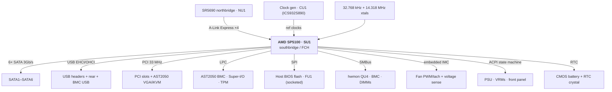
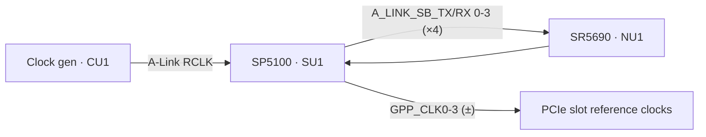
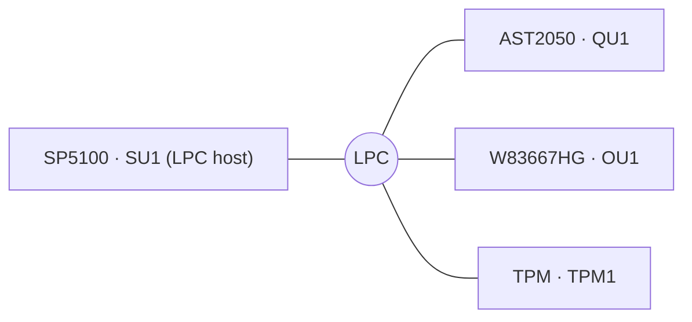
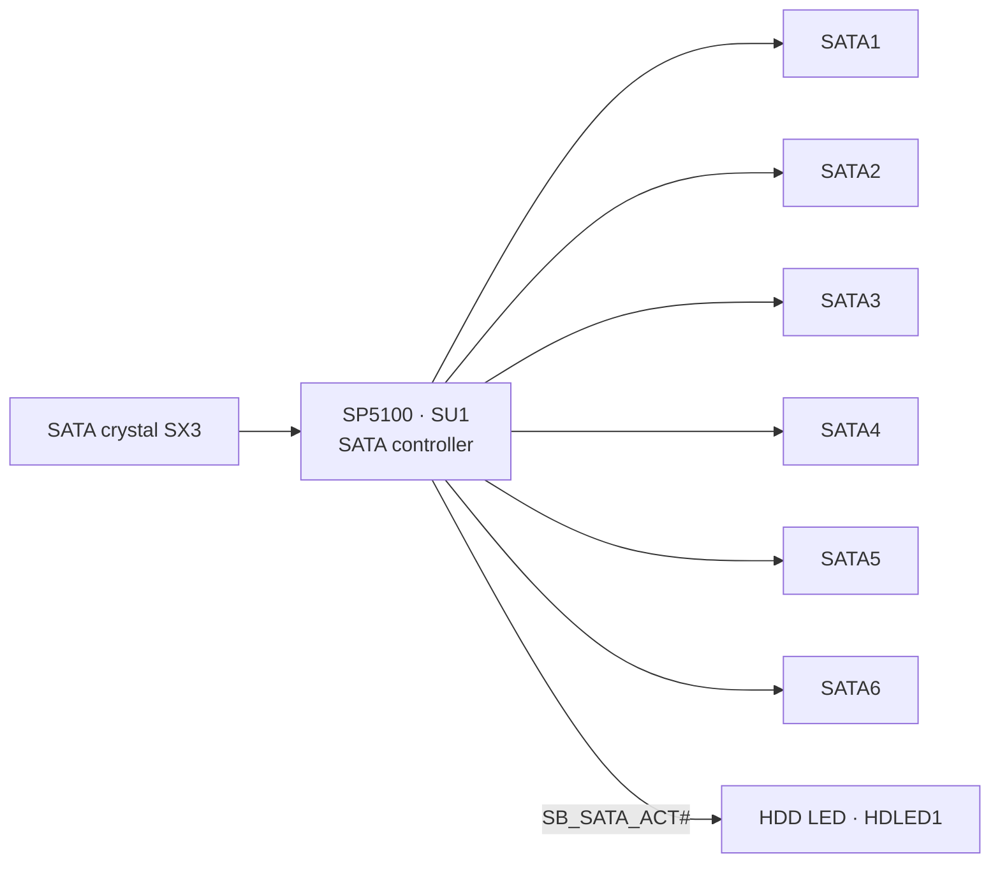
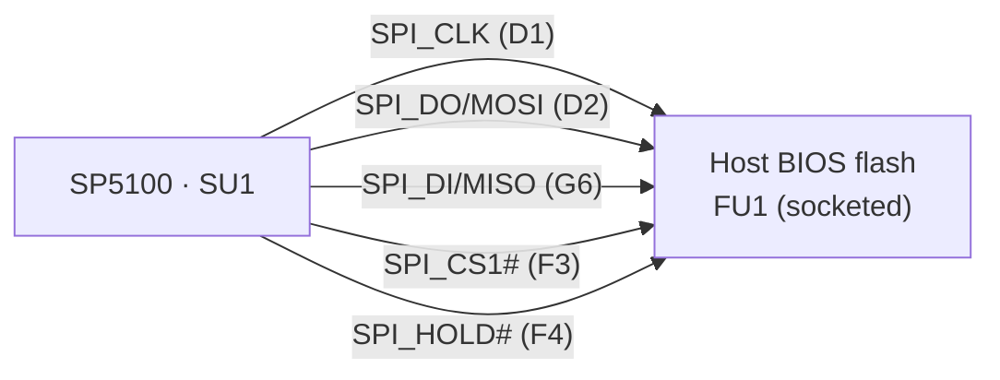
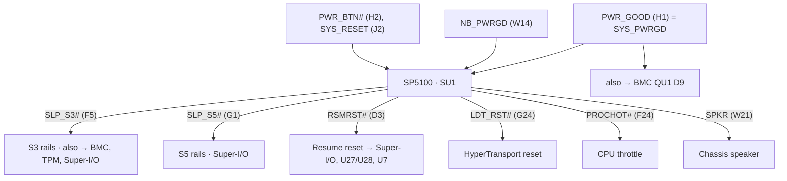

# ASUS KGPE-D16 — AMD SP5100 southbridge wiring

Complete, human-readable documentation of **every pin** of the AMD **SP5100**
southbridge (AMD part `218-0660026`, an SB700-class server FCH; board reference
designator **`SU1`**) on the ASUS KGPE-D16 (rev 1.04B), organised by logical
function. Companion to the [AST2050 BMC](AST2050-BMC-WIRING.md) and
[W83667HG Super-I/O](W83667HG-SUPERIO-WIRING.md) documents; the three chips meet
on the LPC, PCI, USB and SMBus buses.

Same data source and tools as the BMC document; see [README.md](README.md). The
full machine-generated per-pin table for all 528 balls (with a Connected-components
list per section) is in
**[pinmaps/SU1_pins.md](pinmaps/SU1_pins.md)**.

## At a glance

| Property | Value |
|---|---|
| Part | AMD **SP5100** southbridge / FCH (`218-0660026`), FCBGA-528 |
| Ref des | `SU1` |
| Balls | 528 |
| Uplink | A-Link Express (PCIe-like ×4) to **SR5690** northbridge (`NU1`, `215-0716038`) |
| Core supply | `+1V2` (main) |
| I/O supply | `+3V3` (main) |
| Standby supply | `+3V3_AUX`, `+1V2_AUX` (RTC / IMC / wake) |
| BIOS flash | `FU1` — socketed SPI flash (DIP-8) |

### Ball count by function

| Function block | Balls |
|---|---|
| A-Link + PCIe reference clocks (→ NU1) | 34 |
| PCI 33 MHz host (→ slots + BMC) | 60 |
| LPC host (→ BMC + Super-I/O + TPM) | 11 |
| SATA (6 ports) | 34 |
| USB (EHCI + OHCI) | 37 |
| SPI BIOS flash (→ FU1) | 5 |
| SMBus / I²C | 11 |
| Hardware monitor / fans (embedded IMC) | 14 |
| Serial | 2 |
| JTAG | 2 |
| Clocks / RTC crystals | 6 |
| Power / reset / ACPI state machine | 19 |
| Other / GPIO | 45 |
| Power / decoupling | 75 |
| Ground | 120 |
| No-connect | 53 |
| **Total** | **528** |

---

## 1. Block diagram

The SP5100 is the platform's **I/O hub**: it hangs off the SR5690 northbridge
over A-Link and provides SATA, USB, PCI, LPC, SMBus and the RTC. The AST2050 BMC
attaches on three of those buses (LPC, PCI, USB).

For the BMC, the important edges are the three it touches — **LPC** (KCS/IPMI
register access), **PCI** (VGA/iKVM capture), **USB** (virtual media) — plus the
**ACPI power state machine** (`SLP_S3#`/`SLP_S5#`/`PWR_GOOD`), which the BMC
overrides via its own GPIOs for remote power control.

---

## 2. Power — dual domain

Standby rails power the RTC, embedded IMC and wake logic (host off); main rails
power the runtime SATA/USB/PCI/PCIe blocks once the platform is on.

| Rail | Volt | Balls | Domain | Purpose |
|---|---|---|---|---|
| `+1V2` | 1.2 V | 9 | main | Digital core |
| `+3V3` | 3.3 V | 16 | main | I/O ring |
| `+1V2_AUX` | 1.2 V | 4 | standby | Always-on core (wake/IMC) |
| `+3V3_AUX` | 3.3 V | 7 | standby | Always-on I/O |
| `SB_VDD_RTC` | ~3 V | 1 (B2) | battery | RTC / CMOS well |
| `SB_AVDD_SATA_1V2` | 1.2 V | 7 | main | SATA PHY analog |
| `SB_XTLVDD_SATA` / `SB_PLLVDD_SATA` | — | 1+1 | main | SATA crystal + PLL |
| `SB_PCIE_VDDR_1V2` | 1.2 V | 7 | main | PCIe/A-Link regulator |
| `SB_PCIE_PVDD` | — | 1 | main | PCIe PLL |
| `SB_AVDDTXRX_3V3DUAL` | 3.3 V | 12 | main | A-Link/PCIe SerDes analog |
| `SB_CKVDD_1V2` / `SB_AVDDCK_1V2/3V3` | — | 4+2 | main | Clock analog |
| `GND` | 0 V | 120 | — | Ground |

---

## 3. A-Link uplink + PCIe reference clocks → SR5690 (NU1)

The SP5100's link to the rest of the system is **A-Link Express** (an AMD-branded
PCIe ×4) to the SR5690 northbridge (`NU1`). Four TX/RX lanes plus a reference
clock; the southbridge also sources the PCIe reference clocks (`GPP_CLK0–3`) for
the expansion slots.

Key balls: TX lane 3 = T22/T23 (`A_LINK_SB_RX_*3_C` → NU1 AD21/AC21); RX lanes 0–3
= U21/U22, U19, R20/R21, R17/R18; link refclk = N24/N25 (from `CU1`). Full detail:
[pinmaps/SU1 → PCI Express](pinmaps/SU1_pins.md#pci-express-34).

---

## 4. LPC host bus → BMC (QU1) + Super-I/O (OU1) + TPM

The SP5100 is the **LPC host**. Primary control path to the BMC's KCS/IPMI
interface, the Super-I/O and the TPM.

Balls: `LPCCLK0`=G22, `LFRAME#`=H25, `LAD0-3`=H24/H23/J25/J24, `SERIRQ`=V15,
`LDRQ0#`=H22, plus `LPC_PME#`/`LPC_SMI#`. Full detail:
[pinmaps/SU1 → LPC host bus](pinmaps/SU1_pins.md#lpc-host-bus-11).

---

## 5. PCI 33 MHz host → slots + BMC VGA/iKVM

The SP5100 hosts the legacy 32-bit/33 MHz PCI bus shared by the PCI slots and the
**AST2050's VGA/iKVM PCI function**. It drives the full multiplexed interface
(`AD0–31`, `C/BE0–3#`, `FRAME#`, `IRDY#`, `TRDY#`, `DEVSEL#`, `STOP#`, `PAR`,
`LOCK#`, `SERR#`, `PERR#`) plus six PCI clocks (`PCICLK0–5`) — including
`PCICLK1`→BMC (QU1 P22) and `PCICLK3`→hwmon (QU4). `PCIRST#` (N1) resets the bus.

60 balls — see [pinmaps/SU1 → PCI (33MHz)](pinmaps/SU1_pins.md#pci-33mhz-60); the
BMC side is in
[BMC §6](AST2050-BMC-WIRING.md#6-pci-33-mhz-bus-vga--ikvm--sp5100-su1--pci-slots).

---

## 6. SATA — six 3 Gb/s ports

Six SATA ports, each a TX and RX differential pair, to connectors `SATA1`–
`SATA6`, with a dedicated SATA reference crystal (`SATA_X1/X2`) and analog
supplies. Activity is signalled on `SB_SATA_ACT#` → front-panel HDD LED
(`HDLED1`).

| Port | TX± balls | RX± balls | Connector |
|---|---|---|---|
| SATA1 | AD9/AE9 | AC10/AB10 | SATA1 |
| SATA2 | AE10/AD10 | AE11/AD11 | SATA2 |
| SATA3 | AB12/AC12 | AD12/AE12 | SATA3 |
| SATA4 | AD13/AE13 | AC14/AB14 | SATA4 |
| SATA5 | AE14/AD14 | AE15/AD15 | SATA5 |
| SATA6 | AB16/AC16 | AD16/AE16 | SATA6 |

Full detail: [pinmaps/SU1 → SATA](pinmaps/SU1_pins.md#sata-34).

---

## 7. USB — EHCI (high-speed) + OHCI (full-speed)

High-speed pairs (`USB_HSD0`–`USB_HSD9`) and full-speed pairs (`USB_FSD*`) run to
the rear stack, internal headers, and — importantly for the BMC — the AST2050's
USB device port (see [BMC §9](AST2050-BMC-WIRING.md#9-usb-device-port--sp5100-su1)).
A 48 MHz clock (`CLKGEN_48M_SB_USB`) and per-pair overcurrent sense complete it.
37 balls — [pinmaps/SU1 → USB](pinmaps/SU1_pins.md#usb-37).

---

## 8. SPI BIOS flash → `FU1`

The **host BIOS** lives in a socketed SPI flash `FU1` (DIP-8), driven by the
SP5100's SPI controller — separate from the BMC's own flash (`BMC_FW1`). Both
being socketed is a boon for open-firmware experiments.

| SP5100 ball | Pin name | Net | FU1 pin |
|---|---|---|---|
| D1 | `SPI_CLK/GPIO47` | `SB_SPI_CLK_SR` | 6 (CLK) |
| D2 | `SPI_DO/GPIO11` | `SB_SPI_MOSI` | 5 (DI) |
| G6 | `SPI_DI/GPIO12` | `SB_SPI_MISO` | 2 (DO) |
| F3 | `SPI_CS1_L/GPIO32` | `SB_SPI_CS#` | 1 (CS#) |
| F4 | `SPI_HOLD_L/GPIO31` | `SB_SPI_HOLD#` | 7 (HOLD#) |

`FU1` is powered from `+3V3_AUX` (standby), so the BIOS flash is readable with the
host off. Full detail:
[pinmaps/SU1 → SPI / ROM flash](pinmaps/SU1_pins.md#spi--rom-flash-5).

---

## 9. SMBus / I²C

The SP5100 has its own SMBus controllers (`SCL0–3`/`SDA0–3`), which overlap the
BMC's I²C fabric (both reach the hardware monitor `QU4`, the DIMMs and each other
— the `U23` source-select buffer arbitrates ownership; see
[BMC §10](AST2050-BMC-WIRING.md#10-i²c--smbus-topology-traced-through-every-mux--expander)).
The key cross-domain signal is `SB_THERMTRIP#` (`SMBALERT_L/THRMTRIP_L`, ball J6):
a CPU fatal-thermal event that both the SP5100 **and** the BMC (QU1 V3/V4) see.
11 balls — [pinmaps/SU1 → I²C / SMBus](pinmaps/SU1_pins.md#i2c--smbus-11).

---

## 10. Embedded IMC — fan control & hardware monitoring

The SP5100 contains an embedded microcontroller (**IMC**, an 8051) that can do
autonomous fan control and monitoring, parallel to the external W83795G (`QU4`).
Its analog inputs (`VIN0–7`, `TEMPIN0–2`) and fan PWM outputs (`IMC_PWM2/3`) are
wired here; several IMC GPIOs also participate in power sequencing. 14 balls —
[pinmaps/SU1 → Hardware monitor / fans (IMC)](pinmaps/SU1_pins.md#hardware-monitor--fans-imc-14).

---

## 11. Power / reset / ACPI state machine

The SP5100 runs the platform's ACPI power state machine, cooperating with the
Super-I/O. These pins are where the BMC's remote power control physically lands
(`AST_ATXPSON#` drives the PSU; `SYS_PWRGD`/`SLP_S3#`/`SLP_S5#` are read/observed).

| SP5100 ball | Pin name | Net | Meaning |
|---|---|---|---|
| F5 | `SLP_S3#` | `SB_SLP_S3#` | ACPI S3 → Super-I/O, TPM, BMC, PIKE2 |
| G1 | `SLP_S5#` | `SB_SLP_S5#` | ACPI S5 → Super-I/O |
| D3 | `RSMRST#` | `SIO_RSMRST#` | Resume reset → Super-I/O, `U27`/`U28`, `U7` |
| H1 | `PWR_GOOD` | `SYS_PWRGD` | System power-good — **also → BMC QU1 D9** |
| W14 | `NB_PWRGD` | `NB_POWERGOOD` | Northbridge power-good |
| H2 | `PWR_BTN#` | `FP_PWRBTN#` | Front-panel power button (via `SU2`) |
| J2 | `SYS_RESET_L` | `SYS_RST#` | System reset |
| G24 | `LDT_RST#` | `N34238395` | HyperTransport (LDT) reset |
| N2 | `A_RST#` | `SB_A_RST_SR#` | A-Link reset → Super-I/O, TPM |
| G5 | `DDR3_RST_L` | `SB_NMI#` | NMI / DDR reset event |
| F24 | `PROCHOT#` | `SB_PROCHOT#` | CPU thermal throttle |
| K3 | `SUS_STAT#` | `SB_SUS_STAT#` | Suspend status → BMC (QU1 D15), TPM |
| C2 | `INTRUDER_ALERT#` | `INTRUDER#` | Chassis intrusion → Super-I/O, hwmon |
| W21 | `SPKR/GPIO2` | `SB_SPKR_SR` | Chassis speaker |

Full detail:
[pinmaps/SU1 → Power / reset / platform control](pinmaps/SU1_pins.md#power--reset--platform-control-19).

---

## 12. Clocks / RTC

| SP5100 ball | Pin name | Net | Source |
|---|---|---|---|
| A3 / B3 | `X1` / `X2` | `SB_32K_X1/X2` | 32.768 kHz RTC crystal (`SX2`) |
| C3 | `RTCCLK` | `N59274001` | RTC clock header |
| J20 / J21 | `14M_X2` / `14M_X1` | `SB_14M_X1/X2_C` | 14.318 MHz crystal (`SX1`) |
| L18 | `25M_48M_66M_OSC` | `CLKGEN_SB700_14M_CLK` | clock gen `CU1` |
| B2 | `VDD_RTC` | `SB_VDD_RTC` | CMOS battery well |

Full detail: [pinmaps/SU1 → Clocks](pinmaps/SU1_pins.md#clocks-6).

---

## 13. Neighbour-chip reference

| Ref | Part (from schematic) | Role |
|---|---|---|
| `NU1` | AMD SR5690 (`215-0716038`), FCBGA-692 | A-Link uplink partner; PCIe root |
| `CU1` | IDT ICS932S890 clock generator | All `CLKGEN_*` reference clocks |
| `FU1` | Host BIOS SPI flash (socketed DIP-8) | System firmware |
| `QU1` | ASPEED AST2050 BMC | LPC/PCI/USB peer — see [BMC doc](AST2050-BMC-WIRING.md) |
| `OU1` | Nuvoton W83667HG-A Super-I/O | LPC peer — see [Super-I/O doc](W83667HG-SUPERIO-WIRING.md) |
| `TPM1` | TPM header | LPC peer |
| `QU4` | Winbond W83795G hwmon | Shared SMBus sensor device |
| `U27`/`U28` | Winbond W83601G ×2 | DIMM error LEDs (reset by `SIO_RSMRST#`) |
| `SATA1–6` | SATA connectors | Storage |

---

## 14. Complete per-pin table

The exhaustive table of **all 528 balls** — with the Connected-components summary
per section — is in **[pinmaps/SU1_pins.md](pinmaps/SU1_pins.md)**. Regenerate
from the `.FZ` with [`tools/`](tools/); see [README.md](README.md).
