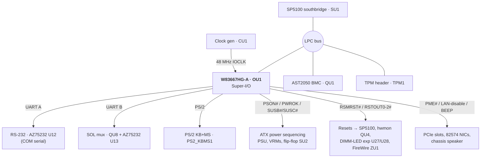
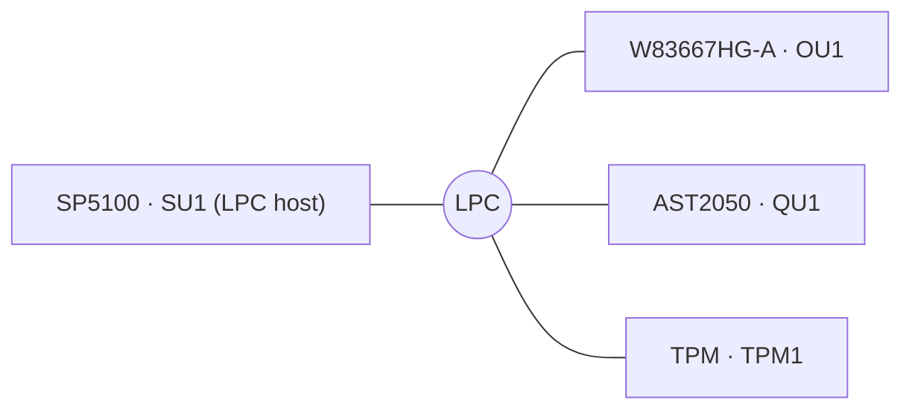
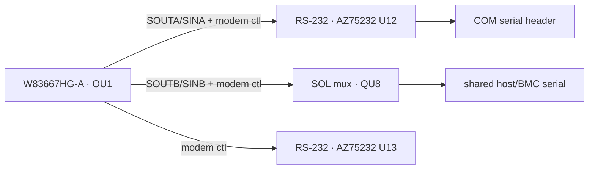
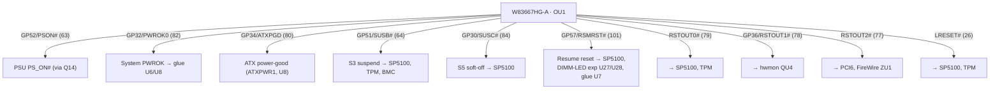

# ASUS KGPE-D16 — Nuvoton W83667HG-A Super-I/O wiring

Complete, human-readable documentation of **every pin** of the Nuvoton
**W83667HG-A** Super-I/O (board reference designator **`OU1`**) on the ASUS
KGPE-D16 (rev 1.04B), organised by logical function. Companion to the
[AST2050 BMC](AST2050-BMC-WIRING.md) and [SP5100 southbridge](SP5100-SOUTHBRIDGE-WIRING.md)
documents; the Super-I/O shares the LPC bus with both.

Same data source and tools as the BMC document — extracted from the OpenBoardView
`.FZ` schematic export; see [README.md](README.md). The full machine-generated
per-pin table for all 128 pins (with a Connected-components list per section) is
in **[pinmaps/OU1_pins.md](pinmaps/OU1_pins.md)**.

## At a glance

| Property | Value |
|---|---|
| Part | Nuvoton **W83667HG-A** Super-I/O, QFP-128 |
| Ref des | `OU1` |
| Pins | 128 (61 unused / no-connect) |
| Host interface | LPC (peripheral on SP5100 bus, shared with BMC + TPM) |
| Main supply | `+3V3` (runtime) |
| Standby supply | `+3V3_AUX` (wake / RSMRST logic) |
| Backup | `VBAT` (RTC/CMOS well) |

### Pin count by function

| Function block | Pins |
|---|---|
| LPC host bus | 7 |
| PCI clock | 1 |
| Serial UART A/B + modem control | 6 + (in GPIO) |
| PS/2 keyboard & mouse | 4 |
| Power / reset / ACPI sequencing | 9 |
| GPIO / straps / misc | 32 |
| LEDs / indicators | 1 |
| I²C-muxed LAN-disable straps | 2 |
| Power / decoupling | 7 |
| Ground | 2 |
| No-connect (unused SIO functions) | 61 |
| **Total** | **128** |

The 61 no-connects are the classic PC Super-I/O functions this server board does
**not** populate — floppy controller, parallel port, second legacy UART pins,
game/MIDI, and consumer-IR — so roughly half the part is dark.

---

## 1. Block diagram

The W83667HG-A is the board's **legacy-I/O bridge**: it hangs off the SP5100's
LPC bus and provides the two 16550 UARTs, PS/2 keyboard/mouse, the ACPI power
button / sleep / reset glue, and a pile of GPIO used as board straps and control.

---

## 2. Power

The Super-I/O straddles standby and main power: `+3V3_AUX` keeps the
wake/RSMRST/GPIO-strap logic alive with the host off; `+3V3` powers the runtime
UART/KBC blocks; `VBAT` backs the config/RTC well.

| Rail | Pins | Domain | Purpose |
|---|---|---|---|
| `+3V3` | 1, 24, 106 | main | UART / KBC / core I/O |
| `+3V3_AUX` | 46, 85 | standby | Wake, RSMRST, GPIO straps |
| `VBAT` | 99 | battery | Config / RTC well |
| `P0_VTT` | 114 | reference | VID sense reference |
| `GND` | (2) | — | Ground |

---

## 3. LPC host bus (shared with BMC + TPM)

The W83667HG-A is an LPC **peripheral** alongside the AST2050 BMC and the TPM
module. This is the legacy-I/O and configuration path.

| OU1 pin | Pin name | Net | Also on |
|---|---|---|---|
| 25 | `LFRAME#` | `LPC_FRAME#` | SU1 H25, QU1 B16, TPM1 3 |
| 23 | `LAD0` | `LPC_LAD0` | SU1 H24, QU1 B17, TPM1 11 |
| 22 | `LAD1` | `LPC_LAD1` | SU1 H23, QU1 A17, TPM1 10 |
| 21 | `LAD2` | `LPC_LAD2` | SU1 J25, QU1 D16, TPM1 8 |
| 20 | `LAD3` | `LPC_LAD3` | SU1 J24, QU1 C16, TPM1 7 |
| 19 | `SERIRQ` | `LPC_SERIRQ` | SU1 V15, QU1 C15, TPM1 16 |
| 18 | `LDRQ#` | `LPC_DRQ0#` | SU1 H22 |
| 17 | `PCICLK` | `SB_PCI_CLK0` | SU1 P4 (LPC reference clock) |
| 15 | `IOCLK` | `CLKGEN_48M_SIO` | CU1 32 (48 MHz) |

Full detail: [pinmaps/OU1 → LPC host bus](pinmaps/OU1_pins.md#lpc-host-bus-7).

---

## 4. Serial UARTs

Two 16550 UARTs. **UART A** is a conventional COM port via RS-232 transceiver
`U12` (BCD **AZ75232**). **UART B** is the host serial that feeds the
Serial-over-LAN mux `QU8` (and a second transceiver `U13`), so it can be shared
with the BMC — see [BMC §12](AST2050-BMC-WIRING.md#12-serial--serial-over-lan-sol).

| OU1 pin | Pin name | Net | To |
|---|---|---|---|
| 34 / 33 | `SOUTA` / `SINA` | `O_TXD1_R` / `O_RXD1_R` | U12 15 / 17 (COM TX/RX) |
| 31/32/29/30/35/36 | `RTSA/DTRA/CTSA/DSRA/DCDA/RIA` | `O_*1#_R` | U12 (COM modem control) |
| 72 / 71 | `SOUTB` / `SINB` | `O_TXD2_R` / `O_RXD2_R` | QU8 4 / 7 (SOL mux) |
| 69/67 | `RTSB` / `CTSB` | `O_RTS2#_R` / `O_CTS2#_R` | QU8 9 / 12 |
| 70/68/73/74 | `DTRB/DSRB/DCDB/RIB` | `O_*2#_R` | U13 (modem control) |

---

## 5. PS/2 keyboard & mouse

The legacy keyboard-controller function drives the rear PS/2 combo connector
(`PS2_KBMS1`); `CN23` are the signal filter capacitors.

| OU1 pin | Pin name | Net | To |
|---|---|---|---|
| 59 | `GP20/KDAT` | `O_KB_DATA` | PS2_KBMS1 1 |
| 58 | `GP21/KCLK` | `O_KB_CLK` | PS2_KBMS1 5 |
| 57 | `GP22/MDAT` | `O_MS_DATA` | PS2_KBMS1 7 |
| 56 | `GP23/MCLK` | `O_MS_CLK` | PS2_KBMS1 11 |
| 27 | `GA20M` | `SIO_A20M` | SU1 Y15 (legacy A20 gate) |
| 28 | `KBRST#/ENVIDO` | `SIO_KBRST#` | SU1 W15 (keyboard-controller reset) |

---

## 6. Power / reset / ACPI sequencing

This is where much of the platform power state machine physically lives. The
Super-I/O generates `PSON#` to the PSU, the `PWROK` rails, the ACPI sleep
signals `SUSB#`(S3)/`SUSC#`(S5), and the resume/peripheral resets.

| OU1 pin | Pin name | Net | Meaning |
|---|---|---|---|
| 63 | `GP52/PSON#` | `N54412916` | PSU soft-on (→ Q14) |
| 82 | `GP32/PWROK0` | `N54413373` | System power-OK (→ glue U6/U8, straps) |
| 47 | `PD3/GP93/PWROK1` | `N37980610` | Secondary PWROK |
| 42 | `PD7/GP97/PWROK2` | `N37987375` | Tertiary PWROK |
| 80 | `GP34/ATXPGD` | `N54413144` | ATX power-good in (ATXPWR1 8, U8) |
| 64 | `GP51/SUSB#` | `N54412689` | ACPI S3 (suspend) → SU1, TPM, BMC, PIKE2 |
| 84 | `GP30/SUSC#` | `N54412463` | ACPI S5 (soft-off) → SU1 |
| 101 | `GP57/RSMRST#` | `SIO_RSMRST#` | Resume reset → SU1, U27, U28, U7 |
| 26 | `LRESET#` | `N54396360` | LPC reset → SU1, TPM |
| 79 | `GP35/RSTOUT0#` | `N54426436` | Reset out → SU1, TPM |
| 78 | `GP36/RSTOUT1#` | `N54426438` | Reset out → hwmon QU4 |
| 77 | `RSTOUT2#` | `N54426440` | Reset out → PCI6, FireWire ZU1 |
| 28 | `KBRST#/ENVIDO` | `SIO_KBRST#` | Keyboard-controller reset → SU1 |
| 100 | `CASEOPEN#` | `INTRUDER#` | Chassis intrusion → hwmon QU4, SU1 |

Full detail: [pinmaps/OU1 → Power / reset / platform control](pinmaps/OU1_pins.md#power--reset--platform-control-9).

---

## 7. GPIO — straps, LAN control, PME, beep

The remaining GPIO carry board straps and control. Highlights:

| OU1 pin | Pin name | Net | Role |
|---|---|---|---|
| 65 | `PME#` | `N54426432` | Power-management event — bussed to all PCIe slots + both 82574L NICs |
| 76 | `IRTX/SDA/GP37` | `SIO_LAN1DISABLE#` | Disable LAN1 (→ LU1 82574L + `LAN_SW1` jumper) |
| 75 | `IRRX/SCL/GP50` | `SIO_LAN2DISABLE#` | Disable LAN2 (→ LU2 82574L + `LAN_SW2` jumper) |
| 51 | `SLIN#/GP84(BEEP)` | `SIO_BEEP` | Chassis speaker / buzzer (`BUZZ1`, `PANEL1`) |
| 60/61 | `GP55/PSOUT#`, `GP54/PSIN#` | power-button in/out | Front-panel power button, via flip-flop `SU2` (74LVC2G74) and SP5100 |
| 128 | `OVT#/SMI#` | `N54458543` | Over-temp / SMI → SU1 |
| 102 | `GP56/SKTOCC` | `N45641504` | Socket-occupied sense |
| 103/107 | `VCORE_REFIN`, `CPUVCORE` | VID sense | CPU core-voltage monitoring |

`GP40–GP47` (pins 67–74) are the UART-B modem-control lines already covered in
§4. Full detail: [pinmaps/OU1 → Other / GPIO](pinmaps/OU1_pins.md#other--gpio-32).

---

## 8. Neighbour-chip reference

| Ref | Part (from schematic) | Relationship to Super-I/O |
|---|---|---|
| `SU1` | AMD SP5100 southbridge | LPC host; power/reset partner |
| `QU1` | ASPEED AST2050 BMC | LPC peer; SOL serial via UART-B/QU8 |
| `TPM1` | TPM header | LPC peer (shares LAD/LFRAME/SERIRQ) |
| `U12`, `U13` | BCD AZ75232 RS-232 | UART-A COM / UART-B modem transceivers |
| `QU8` | Pericom PI5C3257 | UART-B ↔ SOL mux |
| `SU2` | NXP 74LVC2G74 flip-flop | Power-button latch |
| `PS2_KBMS1` | PS/2 combo connector | Keyboard + mouse |
| `QU4` | Winbond W83795G | RSTOUT1# reset; intrusion in |
| `U27`, `U28` | Winbond W83601G ×2 | RSMRST# resets the DIMM-LED expanders |
| `CU1` | IDT ICS932S890 clock gen | 48 MHz IOCLK |
| `ZU1` | LSI FW322 1394A FireWire | RSTOUT2# reset |
| `U6`, `U7`, `U8` | 74LVC07A / TC74LCX74 / 74LVC14A | Power-sequencing glue |

---

## 9. Complete per-pin table

The exhaustive table of **all 128 pins** — with the Connected-components summary
per section — is in **[pinmaps/OU1_pins.md](pinmaps/OU1_pins.md)**. Regenerate
from the `.FZ` with [`tools/`](tools/); see [README.md](README.md).
